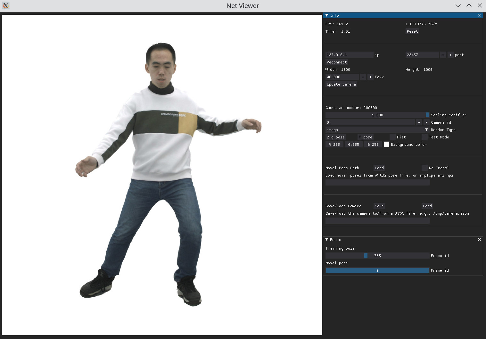

# Real-time High-fidelity Gaussian Human Avatars with Position-based Interpolation of Spatially Distributed MLPs

### [Projectpage](https://gapszju.github.io/mmlphuman) · [Paper](https://arxiv.org/abs/2504.12909) · [Video](https://youtu.be/TeTO4tYRdjw)

## Installation

1. It's recommended to use python=3.10, cuda=12.1, and torch=2.4.1 to set up the environment so that all the packages can be directly downloaded and no compilation is needed.

```shell
conda create -n mmlphuman python=3.10
conda activate mmlphuman

pip install torch==2.4.1 torchvision numpy<2.0 --index-url https://download.pytorch.org/whl/cu121 
pip install iopath ninja jaxtyping rich
pip install gsplat --index-url https://docs.gsplat.studio/whl/pt24cu121
pip install --no-index --no-cache-dir pytorch3d -f https://dl.fbaipublicfiles.com/pytorch3d/packaging/wheels/py310_cu121_pyt241/download.html
pip install imageio numba omegaconf open3d opencv-python scipy smplx scikit-image tensorboardx tensorboard trimesh websockets torchmetrics websocket-client dearpygui plyfile torch_pca
```

2. Download [SMPL-X](https://smpl-x.is.tue.mpg.de/download.php) model, place the neutral npz file to `./smpl_model/smplx/SMPLX_NEUTRAL.npz`.

## Dataset Preparation

1. Download [AvatarReX](https://github.com/lizhe00/AnimatableGaussians/blob/master/AVATARREX_DATASET.md), [ActorsHQ](https://actors-hq.com/), or [THuman4.0](https://github.com/ZhengZerong/THUman4.0-Dataset) datasets.
2. For ActorsHQ dataset, download SMPL-X registration from [here](https://drive.google.com/file/d/1DVk3k-eNbVqVCkLhGJhD_e9ILLCwhspR/view?usp=sharing), and place `smpl_params.npz` at the corresponding root path of each subject.
3. Generate LBS weight volume. 
   - Follow [this link](https://github.com/lizhe00/AnimatableGaussians/blob/master/gen_data/GEN_DATA.md#Preprocessing) to compile executable file `PointInterpolant`.
   - Change the executable file path in `script/gen_weight_volume.py`. Then run
    ```shell
    cd script
    python gen_weight_volume.py --data_dir {DATASET_DIR} --smpl_path ../smpl_model/smplx/SMPLX_NEUTRAL.npz
    ```
4. (Optional) prepare the template mesh. It is recommended for datasets with loose clothing. We use the template mesh for the following subjects
    ```
    AvatarReX: avatarrex_zzr, avatarrex_lbn1
    THuman4.0: subject02
    ActorsHQ: Actor01, Actor04
    ```
    - Templates for `avatarrex_zzr, avatarrex_lbn1, Actor01, Actor04` can be downloaded from [here](https://github.com/lizhe00/AnimatableGaussians/blob/master/PREPROCESSED_DATASET.md). We include the template for `subject02` in `./template`. Follow [this link](https://github.com/lizhe00/AnimatableGaussians/blob/master/gen_data/GEN_DATA.md#Preprocessing) if you want to reconstruct a template from a dataset.
    - Place the template file in `{DATASET_DIR}/gaussian/template.ply`. If no template is provided, SMPL-X mesh will be used as the template during training.

The dataset will look like this after preparation. 
```
AvatarReX dataset
├── 22010708 
├── 22010710 
├── calibration_full.json
├── gaussian
│   ├── lbs_weights_grid.npz
│   └── template.ply
└── smpl_params.npz

THuman4.0 dataset
├── calibration.json
├── gaussian
│   ├── lbs_weights_grid.npz
│   └── template.ply
├── images
│   ├── cam00 
│   └── cam01 
├── masks
│   ├── cam00 
│   └── cam01
└── smpl_params.npz

ActorsHQ dataset
├── calibration.csv
├── gaussian
│   ├── lbs_weights_grid.npz
│   └── template.ply
├── masks
│   ├── Cam001 
│   └── Cam002
├── rgbs
│   ├── Cam001 
│   └── Cam002 
└── smpl_params.npz
```

## Training
```shell
python train.py --config ./config/{DATASET}.yaml --data_dir {DATASET_DIR} --out_dir {MODEL_DIR}
```
It will take about 17 hours on a RTX 3090. We have not yet implemented the function to resume training from a checkpoint, so please be cautious during training.

## Visualization

To visualize the results during training, open the viewer, set ip, port, and connect
```shell
cd viewer
python net_viewer.py 
```

To visualize a trained model
```shell
python visualize.py --model_dir {MODEL_DIR} --ip {IP} --port {PORT}

cd viewer
python net_viewer.py
```



## Test and Evaluation

To render images using training poses and training cameras, modify the test part in the config, and run:
```shell
python test.py --config ./config/{DATASET}.yaml --model_dir {MODEL_DIR} --out_dir {IMAGE_OUR_DIR} --data_dir {DATASET_DIR}
```

To render images using novel poses and novel views, run:
```shell
python test.py --config ./config/{DATASET}.yaml --model_dir {MODEL_DIR} --out_dir {IMAGE_OUR_DIR} --cam_path {CAM_FILE} --pose_path {POSE_FILE} [--test]
```
`CAM_FILE` is a JSON file and can be exported from the viewer. `POSE_FILE` refers to AMASS pose file or `smpl_params.npz`

To test the rendering speed, run:
```shell
python test.py --config ./config/{DATASET}.yaml --model_dir {MODEL_DIR} --cam_path {CAM_FILE} --pose_path {POSE_FILE} --test_speed [--test] 
```

Evaluation example codes are provided in `script/eval.ipynb`

## Acknowledgement
This project uses [gsplat](https://github.com/nerfstudio-project/gsplat) rasterizer. We also use some data processing and evaluation code from [AnimatableGaussians](https://github.com/lizhe00/AnimatableGaussians) and [Gaussian-Splatting](https://github.com/graphdeco-inria/gaussian-splatting). We greatly thank the authors for their wonderful works.

## Citation
```bibtex
@article{zhan2025realtime,
    title={Real-time High-fidelity Gaussian Human Avatars with Position-based Interpolation of Spatially Distributed MLPs},
    author={Zhan, Youyi and Shao, Tianjia and Yang, Yin and Zhou, Kun},
    journal={arXiv preprint arXiv:2504.12909},
    year={2025}
}
```

